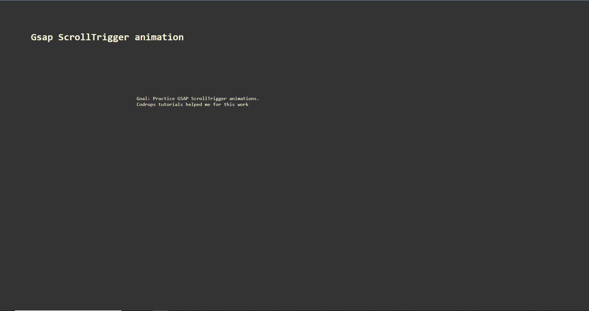
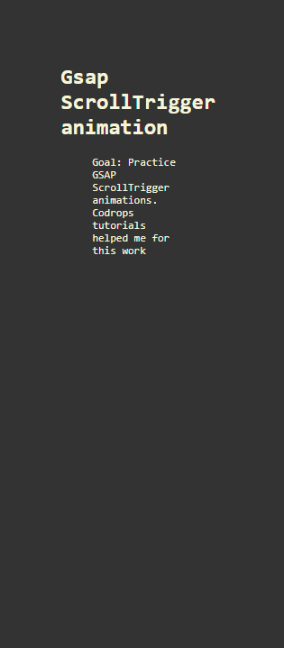
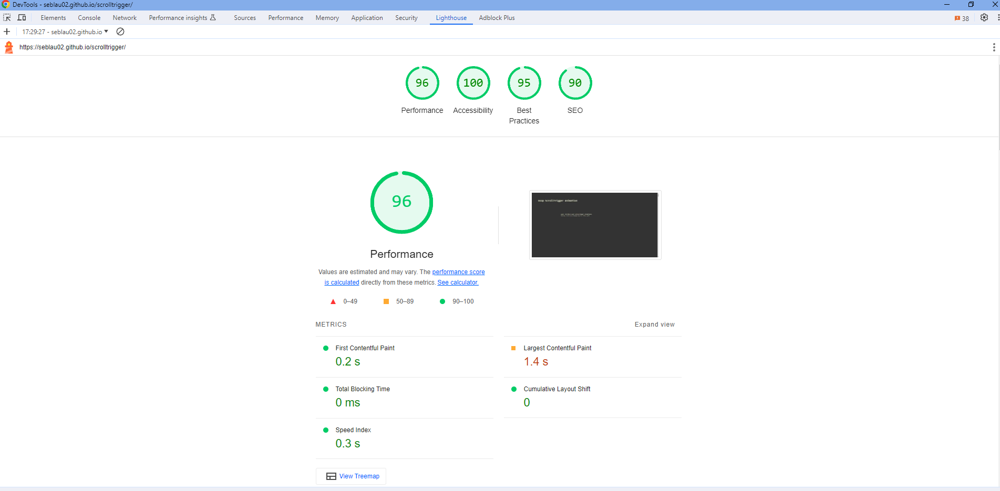

## ScrollTrigger - Gsap animation

## Fr

### Description

Scroll animation avec gsap.

### Détails

Ce projet a été un exercice pour pratiquer scrolltrigger de gsap, il m'a permis de voir comment les animations au scroll sont facile avec gsap.
Je me suis inspiré des travaux et tutoriels de codrops.
J'ai utilisé Lenis smooth scroll pour le smooth scroll.
Les images sont issu de unsplash.

Je vous laisse le découvrir [ici](https://seblau02.github.io/scrolltrigger/)

## En

This project is my first attempt at using ScrollTrigger and GSAP animations. It served as a practice session, and I thoroughly enjoyed the experience. It allowed me to explore ScrollTrigger and understand how scroll animations can be easily implemented with it. I drew inspiration from Codrops tutorials for this project. Additionally, I utilized Lenis smooth scroll to enhance the scrolling experience. The images used in the project are sourced from Unsplash.

To view the site, click [here](https://seblau02.github.io/scrolltrigger/)

### Technologies: HTML, CSS, JS, Greensock

### Images:

